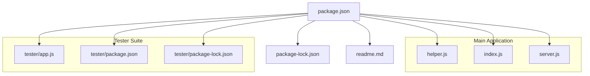
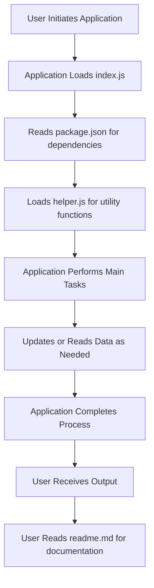

# Architecture

This document contains the architectural overview and diagrams for the system.

## Architecture Diagram 1

```mermaid
graph TD
    A[helper.js]
    B[index.js]
    C[server.js]
    D[package.json]
    E[package-lock.json]
    F[readme.md]
    G[tester/app.js]
    H[tester/package.json]
    I[tester/package-lock.json]

    D --> A
    D --> B
    D --> C
    D --> G
    D --> E
    D --> H
    D --> I
    D --> F

    subgraph Main Application
        A
        B
        C
    end

    subgraph Tester Suite
        G
        H
        I
    end
```

## Architecture Diagram 2

```mermaid
flowchart TD
    A[User Initiates Application] --> B[Application Loads index.js]
    B --> C[Reads package.json for dependencies]
    C --> D[Loads helper.js for utility functions]
    D --> E[Application Performs Main Tasks]
    E --> F[Updates or Reads Data as Needed]
    F --> G[Application Completes Process]
    G --> H[User Receives Output]
    H --> I[User Reads readme.md for documentation]
```

